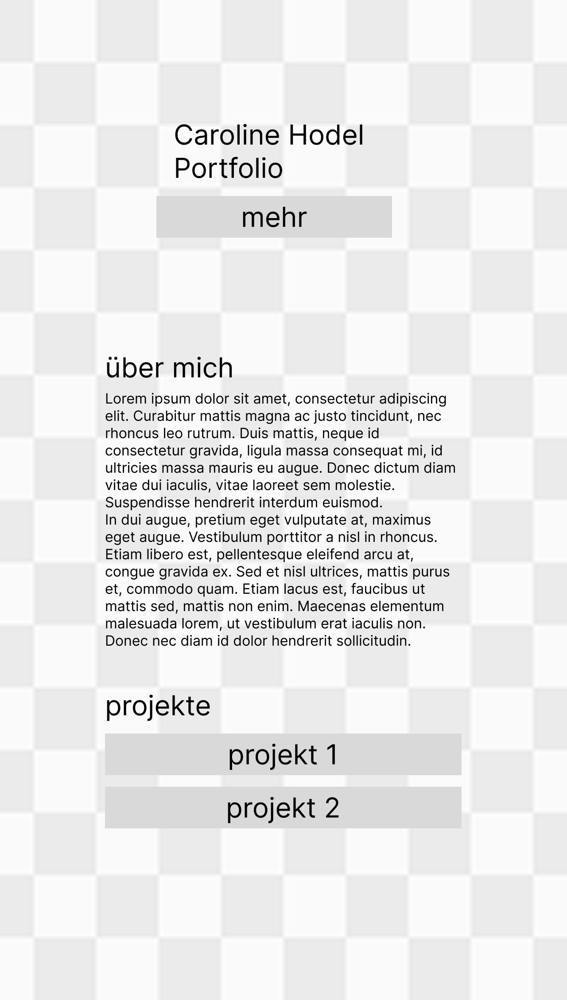
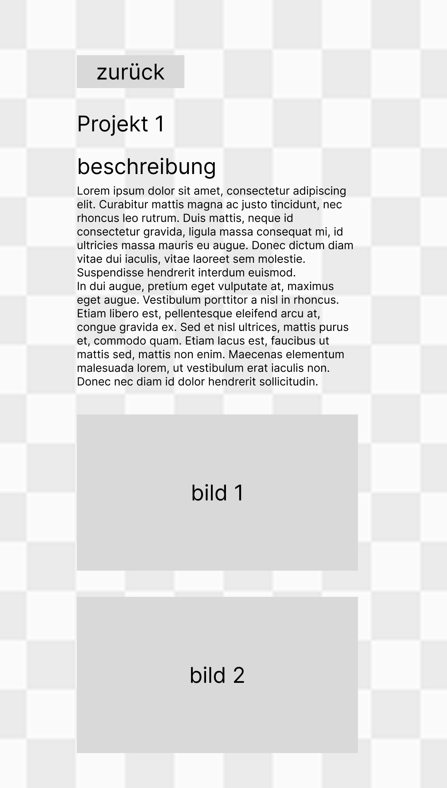

# Dokumentation Frontend

## Mini Konzept und Überlegungen

|             Konzept Home              |            Konzept Detail             |               Altes Konzept               |
|:-------------------------------------:|:-------------------------------------:|:-----------------------------------------:|
|      |      |      |

Ich muss ehrlich sein, beim Konzept hatte ich zuerst zu viele Ideen, ich probierte vieles aus und am Ende war dann nichts wirklich fertig. Also erstellte ich das oben gezeigte, um mir etwas Freiheit aber dennoch die Einfachheit beizubehalten, sonst wäre ich nie fertig geworden. Deswegen ist nun die Website sehr einfach und simpel, ich habe dir aber noch die Screens von meinem ersten (und klein noch das zweite) Konzept hinzugefügt, das will ich aber beenden, wenn ich keinen Zeitdruck habe.

----

## Tagebuch
Wichtig! Ich kenne die genauen nicht mehr, da ich nicht während der Entwicklung notierte, sondern danach. Deswegen habe ich nun Tag 1, 2 etc. gewählt.

### Tag 1
Zuerst startete ich mit dem Design meiner ersten Portfolio Seite. Dort verbrauchte ich viel Zeit mit der Planung, der Gestaltung und der Ideenfindung.

### Tag 2
Nun begann ich zu entwickeln. Ich brauche dafür Webstorm und zuerst musste ich mich wieder etwas damit befassen, bevor ich komplett starten konnte. Die Entwicklung der Seite fand grösstenteils mit Chatgpt, Deepseek und Perplexity statt, aber StackOverflow wurde auch paarmal besucht.

### Tag 3
Ich veröffentliche die Seite mit Github Pages und programmiere weiter.

### Tag 4
Nun näherte ich mich der Abgabe und realisierte, dass ich dies nie sauber in der verfügbaren Zeit schaffen würde. Deswegen startete ich neu, mit einem anderen Konzept.

### Tag 5
Auch bei diesem Konzept hatte ich mir erneut zu viel vorgenommen. Ich bin nun sehr nahe an der Abgabe und sehr gestresst. Ich werde langsam krank.

### Tag 6
Ich setze mich erneut vor Figma, nun muss ich mich wirklich zurückhalten. Ich wähle ein solch simples Design, dass ich es mit der Unterstützung der KI und meinem Wissen, gut in der vorgegebenen Zeit schaffen kann.

### Tag 7
Ich ändere, während dem Entwickeln noch das Design ein wenig, da mir der Ursprung nicht so gut gefiel. Ich fügte noch meine Projekte hinzu und verlinkte dies nun mit je einer Galerie, wo ich die Projekte auflisten könnte. Die Farben werden oft geändert, der Hintergrund auch.

### Tag 8
Ich bin sehr krank. Ich beende das Projekt und korrigiere noch allfällige Bugs und versuche Redundanzen zu vermeiden. Ich bin müde.

Link github pages: https://c450.github.io/portfolio/index.html
